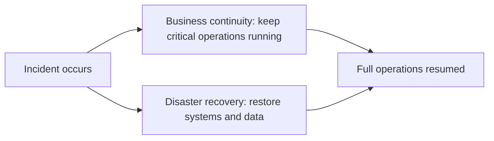

# business-continuity-vs-disaster-recovery
Plain-English guide to business continuity vs. disaster recovery: definitions, RTO/RPO, a comparison table, and a readiness checklist. By ZIA Networks.
# Business Continuity vs. Disaster Recovery

> **Business continuity (BC)** keeps your entire business running during a disruption. **Disaster recovery (DR)** restores your IT systems and data afterward. Most businesses need both.

A practical guide by **[ZIA Networks](https://your-website.com)**.

## Table of Contents

- [The Short Answer](#the-short-answer)
- [What Is Business Continuity?](#what-is-business-continuity)
- [What Is Disaster Recovery?](#what-is-disaster-recovery)
- [Side-by-Side Comparison](#side-by-side-comparison)
- [How They Work Together](#how-they-work-together)
- [RTO and RPO Explained](#rto-and-rpo-explained)
- [Why One Without the Other Fails](#why-one-without-the-other-fails)
- [Does Your Business Need Both?](#does-your-business-need-both)
- [Readiness Checklist](#readiness-checklist)
- [FAQ](#faq)
- [About ZIA Networks](#about-zia-networks)
- [Contributing](#contributing)
- [License](#license)

## The Short Answer

| | Business Continuity | Disaster Recovery |
|---|---|---|
| **Question it answers** | How do we keep serving customers right now? | How do we get our systems and data back? |
| **Protects** | Operations, people, customer service | Technology and data |
| **Relationship** | The overall strategy | A part of that strategy |

## What Is Business Continuity?

Business continuity is a company's plan for keeping essential operations running during and after a disruption such as a cyberattack, power outage, natural disaster, or supplier failure.

A business continuity plan (BCP) usually covers:

- **Critical functions:** processes that must keep running, such as customer support, payroll, or order fulfillment
- **Alternate ways of working:** remote work, backup locations, or manual workarounds
- **Communication plans:** who informs employees, customers, and partners, and how
- **Roles and responsibilities:** who makes decisions when the usual chain of command is unavailable
- **Supplier contingencies:** backup options if a key vendor is also affected

## What Is Disaster Recovery?

Disaster recovery is the technical side of continuity. It is the process of restoring IT infrastructure, applications, and data after an incident such as ransomware, hardware failure, or a natural disaster.

A disaster recovery plan (DRP) usually includes:

- **Regular backups** stored in separate, secure locations
- **Recovery procedures** for servers, databases, and applications
- **Failover systems** that take over when primary systems go down
- **Testing schedules** to confirm that backups actually restore
- **Recovery targets** (RTO and RPO, below)

## Side-by-Side Comparison

| | Business Continuity | Disaster Recovery |
|---|---|---|
| **Scope** | Entire organization | IT systems and data |
| **Goal** | Keep operating during a disruption | Restore systems after one |
| **Timing** | During and after the crisis | Mainly after the incident |
| **Led by** | Leadership and operations | IT and security teams |
| **Focus** | People, processes, resilience | Technology, data, infrastructure |

## How They Work Together

**Hospital example:** during a power cut, staff switch to generators and paper charts so patient care never stops (business continuity). Meanwhile, IT brings the electronic records system back online (disaster recovery).

## RTO and RPO Explained

- **Recovery Time Objective (RTO):** how long your business can afford to be down. An RTO of two hours means systems must be back within two hours.
- **Recovery Point Objective (RPO):** how much data you can afford to lose, measured in time. An RPO of one hour means backups at least every hour.

Set these numbers from **business priorities**, not IT preferences. That is why both plans should be built together.

## Why One Without the Other Fails

- **DR without BC:** your data is safe, but nobody knows how to operate while it is restored. Customers can't reach you and revenue stops.
- **BC without DR:** your team is ready to work, but the data or systems they need are gone.

## Does Your Business Need Both?

In almost every case, yes. Scale the plan to your business:

| Business size | Where to start |
|---|---|
| **Small** | Tested cloud backups, a list of critical functions, manual workarounds, a communication plan |
| **Growing** | Add defined RTOs and RPOs, documented roles, alternate work arrangements, scheduled tests |
| **Large or regulated** | Formal, audited programs driven by regulations and customer requirements |

## Readiness Checklist

Copy this list into your own repo, issue, or document and tick items off.

- [ ] Completed a business impact analysis of critical processes
- [ ] Identified key risks (cyberattack, outage, natural disaster, key-person loss, vendor failure)
- [ ] Set an RTO and RPO for each critical system
- [ ] Backups are stored in a separate, secure location
- [ ] Performed a **test restore** of backups in the last 12 months
- [ ] Documented roles, owners, and decision-makers
- [ ] Created a communication plan for staff, customers, and partners
- [ ] Defined alternate ways of working (remote access, backup site, manual workarounds)
- [ ] Listed backup options for key suppliers
- [ ] Scheduled an annual review and a tabletop exercise

## FAQ

<b>Is disaster recovery part of business continuity?</b>

Yes. Disaster recovery is a subset of business continuity that focuses on restoring IT systems and data.

<b>What is the difference between a BCP and a DRP?</b>

A BCP keeps the whole business running during a disruption. A DRP restores technology afterward.

<b>Does a small business need both?</b>

Yes, but both can be simple: tested cloud backups, a list of critical functions, and a clear communication plan.

<b>How often should these plans be tested?</b>

At least once a year, and whenever your systems, staff, or key vendors change significantly.

## About ZIA Networks

ZIA Networks helps businesses assess risks, protect their data and networks, and put practical continuity and recovery plans in place, so a disruption becomes an inconvenience rather than a crisis.

**[Contact ZIA Networks](https://your-website.com/contact)** to check whether your current plan would hold up.

## Contributing

Suggestions and corrections are welcome. Please open an [issue](../../issues) or submit a pull request.

## License

This work is licensed under [CC BY 4.0](https://creativecommons.org/licenses/by/4.0/). You may share and adapt it with attribution to ZIA Networks.
